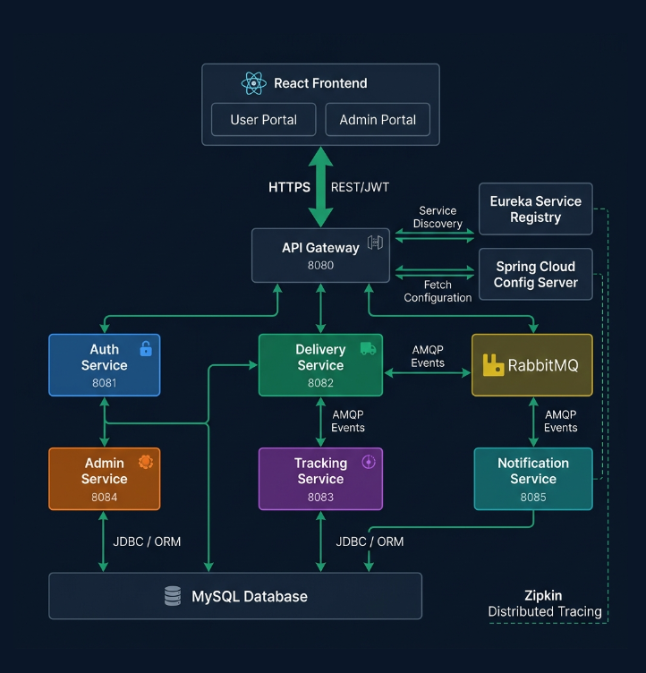

# 🚀 SmartCourier Logistics Ecosystem

<div align="center">
  
  
  
  
  
  
</div>

<br />

An enterprise-grade, event-driven microservices platform designed to orchestrate the complete logistics lifecycle—from dynamic shipping calculations and package booking to real-time tracking and asynchronous customer notifications. 

Built as a comprehensive Capgemini Full Stack Case Study, this project demonstrates modern cloud-native architectural patterns, including the **Database-per-Service paradigm**, **Event-Driven Architecture (EDA)**, and a **React Monorepo**.

---

## 🏗 Architecture Overview

SmartCourier completely decouples the client presentation layers from the backend services. The backend utilizes **Spring Cloud** for API Gateway routing and service discovery, communicating asynchronously via **RabbitMQ** to prevent blocking operations during high-latency tasks (like SMTP email dispatches).

> **System Architecture**
> 
> 

### 🧩 Microservices Landscape

| Service | Port | Description |
| :--- | :--- | :--- |
| **API Gateway** | `8080` | Central entry point. Handles routing, CORS, and Trace ID generation. |
| **Eureka Registry** | `8761` | Dynamic service discovery and registry. |
| **Config Server** | `8888` | Centralized external configuration management. |
| **Auth Service** | `8081` | Handles JWT generation, 2FA OTP handshakes, and RBAC security. |
| **Delivery Service**| `8082` | Core business logic: pricing algorithms, bookings, and invoicing. |
| **Tracking Service**| `8083` | Manages location updates and timestamped delivery history logs. |
| **Notification Service**| `8084` | Consumes RabbitMQ events to dispatch asynchronous emails. |

---

## ✨ Key Features

### Backend
* **Stateless Security:** 2-Factor authentication using JSON Web Tokens (JWT) + a 6-digit OTP handshake via SMTP.
* **Database-per-Service:** Strict data isolation using individual MySQL schemas (`smartcourier_auth`, `smartcourier_delivery`, `smartcourier_tracking`).
* **Event-Driven Operations:** Booking a delivery fires a `DeliveryBookedEvent` to RabbitMQ, decoupling the database transaction from the slow email notification process.
* **Distributed Observability:** 100% request visibility using **Zipkin** and **Micrometer**. Trace IDs are propagated across all microservices for structured SLF4J logging.
* **Global Exception Handling:** `@RestControllerAdvice` ensures clean, standardized JSON error responses instead of backend stack traces.

### Frontend (React Monorepo)
* **Modular Codebase:** `frontend-admin` and `frontend-user` managed in a single Git repository.
* **Custom Hook Pattern:** Extraction of Axios logic and `useEffect` side-effects into custom hooks (e.g., `useDeliveries`, `useTracking`), keeping UI components purely functional.
* **Axios Interceptors:** Automatic JWT header attachment and graceful global 401 Unauthorized handling.

---

## 🛠 Tech Stack

**Backend:** Java 21, Spring Boot 3.5, Spring Cloud (Gateway, Eureka, Config), Spring Data JPA, Hibernate, JWT.  
**Frontend:** React 18, TypeScript/JavaScript, Tailwind CSS, Axios, React Router.  
**Infrastructure & DevOps:** Docker, Docker Compose, RabbitMQ, Zipkin, MySQL, Maven, Git.

---

## 🚀 Local Setup & Installation

### Prerequisites
* Java 21+
* Node.js 18+
* Docker Desktop (Required for MySQL, RabbitMQ, and Zipkin)
* Maven 3.8+

### 1. Boot the Infrastructure
We use Docker to spin up the required databases and message brokers instantly.

```bash
# Navigate to the project root
cd SmartCourier

# Start MySQL, RabbitMQ, and Zipkin in detached mode
docker compose up -d
